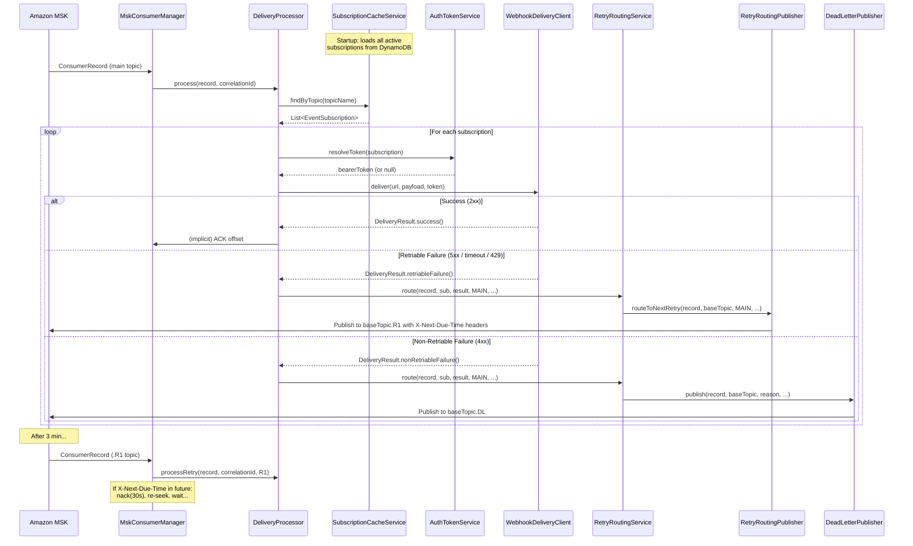

# delivery-listener

**Production-ready Spring Boot 3.5 / Java 21 service** that consumes events from
Amazon MSK (Kafka), looks up active subscriber configurations in DynamoDB
(`glbl-event-subscription`), and delivers event payloads to subscriber webhook URLs
via HTTP POST. Failed deliveries are routed through a staged retry topology
(R1 → R2 → R3 → DL) using dedicated Kafka retry topics.

---

## Table of Contents

1. [Architecture Summary](#architecture-summary)
2. [Assumptions](#assumptions)
3. [Project Structure](#project-structure)
4. [Quick Start (Local)](#quick-start-local)
5. [Build & Run](#build--run)
6. [Docker](#docker)
7. [Kubernetes / EKS Deployment](#kubernetes--eks-deployment)
8. [Helm Deployment](#helm-deployment)
9. [Configuration Reference](#configuration-reference)
10. [Admin API (curl examples)](#admin-api-curl-examples)
11. [Retry Flow](#retry-flow)
12. [DynamoDB Item Mapping](#dynamodb-item-mapping)
13. [Sequence Diagram](#sequence-diagram)
14. [Observability](#observability)
15. [Operational Runbook](#operational-runbook)
16. [Sample Kafka Message](#sample-kafka-message)
17. [Sample DynamoDB Item](#sample-dynamodb-item)
18. [Phase 2 Recommendations](#phase-2-recommendations)

---

## Architecture Summary

```
┌──────────────────────────────────────────────────────────────────┐
│                        EKS Pod (N replicas)                      │
│                                                                  │
│  ┌──────────────┐   findByTopic()   ┌────────────────────────┐  │
│  │ MskConsumer  │──────────────────▶│ SubscriptionCacheService│  │
│  │ Manager      │                   │ (in-memory, 24h refresh)│  │
│  │              │                   └────────────┬───────────┘  │
│  │  MAIN        │                        ▲       │ findAll()     │
│  │  R1          │                        │       ▼              │
│  │  R2          │   process()    ┌────────────────┐             │
│  │  R3          │──────────────▶│ DeliveryProcessor│             │
│  └──────────────┘               └───────┬────────┘             │
│          ▲                              │                        │
│          │ rebuildConsumers()           │ deliver()             │
│  ┌───────┴────────────┐               ▼                        │
│  │ Subscription       │  ┌────────────────────────┐            │
│  │ RefreshScheduler   │  │ WebhookDeliveryClient   │            │
│  │ (every 24h)        │  │ (HTTP POST + auth)      │            │
│  └────────────────────┘  └────────────┬───────────┘            │
│                                       │ failure                  │
│  ┌─────────────────┐                 ▼                          │
│  │ DynamoDB        │  ┌────────────────────────┐               │
│  │ Repository      │  │ RetryRoutingService     │               │
│  └─────────────────┘  │ + RetryRoutingPublisher │               │
│                        │ + DeadLetterPublisher   │               │
│                        └────────────────────────┘               │
└──────────────────────────────────────────────────────────────────┘
         │                        │
    Amazon MSK               DynamoDB
  (topics / retry)     (glbl-event-subscription)
```

### Layers

| Layer | Package | Responsibility |
|-------|---------|----------------|
| API | `api.controller`, `api.dto` | REST admin endpoints |
| Application | `application.service`, `application.scheduler` | Business orchestration |
| Domain | `domain.model`, `domain.repository` | Core models and interfaces |
| Infrastructure | `infrastructure.*` | DynamoDB, Kafka, HTTP |

---

## Assumptions

| # | Assumption | Rationale |
|---|-----------|-----------|
| 1 | `topicName` in DynamoDB stores the **base** topic name only. Retry topics are derived by appending `.R1`, `.R2`, `.R3`, `.DL`. | Topic suffix pattern observed in screenshots |
| 2 | `subscriberStatus` and `topicStatus` values may be any case; normalised to uppercase. | Case sensitivity not guaranteed in DynamoDB |
| 3 | `maxAttempts` in DynamoDB overrides the global 3-retry default when present. | Per-subscription SLA control |
| 4 | `retryWindow` field is preserved in the model but not yet used; staged delays are fixed. | Future enhancement |
| 5 | `targetDispatcher` is modelled but unused (reserved for Day-2 multi-dispatcher routing). | Screenshot reference |
| 6 | Dynamic topic subscription uses **approach #3** (explicit topic list rebuilt on cache refresh). This means a brief consumption gap of <1 second during 24h refresh. | Most maintainable; avoids broad pattern consumption |
| 7 | Multiple subscriptions on the same topic are all delivered independently. Failure for one subscriber does not block delivery to others. | Independent fan-out |
| 8 | OAuth2 client credentials (`OAUTH_CLIENT_ID`, `OAUTH_CLIENT_SECRET`) are injected via Kubernetes Secrets; not stored in DynamoDB. | Security best practice |
| 9 | Full DynamoDB table scan is acceptable for the 24h refresh cycle. For very large tables, a GSI on status fields is recommended (Phase 2). | DynamoDB scan is ~$0.025 per million reads |
| 10 | Spring Boot 3.5.0 is targeted. If unavailable, use 3.4.x; API changes are minimal. | Future release |

---

## Project Structure

```
delivery-listener/
├── pom.xml
├── Dockerfile
├── README.md
├── k8s/
│   ├── deployment.yaml
│   ├── service.yaml
│   ├── configmap.yaml
│   ├── secret.yaml
│   ├── serviceaccount.yaml
│   ├── hpa.yaml
│   └── pdb.yaml
├── helm/
│   ├── Chart.yaml
│   ├── values.yaml
│   └── templates/
│       ├── _helpers.tpl
│       ├── deployment.yaml
│       ├── configmap.yaml
│       ├── hpa.yaml
│       └── pdb.yaml
└── src/
    ├── main/
    │   ├── java/com/company/deliverylistener/
    │   │   ├── DeliveryListenerApplication.java
    │   │   ├── api/
    │   │   │   ├── controller/{SubscriptionController,TopicController,MetricsController,RetryConfigController}.java
    │   │   │   └── dto/{SubscriptionResponse,DeliverySummaryResponse,RetryConfigResponse}.java
    │   │   ├── application/
    │   │   │   ├── service/{SubscriptionCacheService,DeliveryProcessor,RetryRoutingService,
    │   │   │   │            AuthTokenService,TopicDiscoveryService,RetryDueTimeEvaluator,
    │   │   │   │            DeliveryMetricsService}.java
    │   │   │   └── scheduler/SubscriptionRefreshScheduler.java
    │   │   ├── config/properties/{AppProperties,KafkaProperties,RetryProperties,WebhookProperties}.java
    │   │   ├── domain/
    │   │   │   ├── model/{EventSubscription,AuthType,SubscriberStatus,TopicStatus,
    │   │   │   │          RetryStage,RetryMetadata,DeliveryResult}.java
    │   │   │   └── repository/SubscriptionRepository.java
    │   │   └── infrastructure/
    │   │       ├── dynamodb/{DynamoDbConfig,DynamoDbSubscriptionRepository}.java
    │   │       ├── http/{WebClientConfig,WebhookDeliveryClient}.java
    │   │       ├── kafka/
    │   │       │   ├── config/KafkaConfig.java
    │   │       │   ├── consumer/{MessageDispatchListener,RetryConsumerListener,MskConsumerManager}.java
    │   │       │   ├── headers/RetryHeaders.java
    │   │       │   └── producer/{RetryRoutingPublisher,DeadLetterPublisher}.java
    │   │       └── security/SecurityConfig.java
    │   └── resources/{application.yml,logback-spring.xml}
    └── test/
        └── java/com/company/deliverylistener/
            ├── dynamodb/DynamoDbSubscriptionRepositoryIT.java
            ├── http/WebhookDeliveryClientTest.java
            ├── kafka/KafkaRetryFlowIT.java
            └── service/{SubscriptionCacheServiceTest,DeliveryProcessorTest,RetryRoutingServiceTest}.java
```

---

## Quick Start (Local)

### Prerequisites

- JDK 21
- Maven 3.9+
- Docker (for Testcontainers)
- LocalStack (optional, for DynamoDB local)

```bash
# 1. Start local Kafka + LocalStack (DynamoDB)
docker run -d -p 9092:9092 confluentinc/cp-kafka:7.6.1

# 2. Set environment
export AWS_REGION=us-east-1
export KAFKA_BOOTSTRAP_SERVERS=localhost:9092
export KAFKA_SECURITY_PROTOCOL=PLAINTEXT
export AWS_ENDPOINT_OVERRIDE=http://localhost:4566

# 3. Build and run
./mvnw spring-boot:run -Dspring-boot.run.profiles=local
```

---

## Build & Run

```bash
# Build (skipping tests)
./mvnw clean package -DskipTests

# Run unit tests
./mvnw test

# Run integration tests (requires Docker)
./mvnw verify

# Run with specific profile
java -jar target/delivery-listener-1.0.0-SNAPSHOT.jar --spring.profiles.active=local
```

---

## Docker

```bash
# Build image
docker build -t delivery-listener:1.0.0 .

# Run locally
docker run -p 8080:8080 \
  -e AWS_REGION=us-east-1 \
  -e KAFKA_BOOTSTRAP_SERVERS=host.docker.internal:9092 \
  -e KAFKA_SECURITY_PROTOCOL=PLAINTEXT \
  -e ADMIN_PASSWORD='{noop}changeme' \
  delivery-listener:1.0.0
```

### Push to ECR

```bash
aws ecr get-login-password --region us-east-1 | \
  docker login --username AWS --password-stdin 123456789012.dkr.ecr.us-east-1.amazonaws.com

docker tag delivery-listener:1.0.0 \
  123456789012.dkr.ecr.us-east-1.amazonaws.com/delivery-listener:1.0.0

docker push 123456789012.dkr.ecr.us-east-1.amazonaws.com/delivery-listener:1.0.0
```

---

## Kubernetes / EKS Deployment

```bash
# Create namespace
kubectl create namespace delivery

# Apply all manifests
kubectl apply -f k8s/serviceaccount.yaml
kubectl apply -f k8s/configmap.yaml
kubectl apply -f k8s/secret.yaml         # Edit first with real values!
kubectl apply -f k8s/deployment.yaml
kubectl apply -f k8s/service.yaml
kubectl apply -f k8s/hpa.yaml
kubectl apply -f k8s/pdb.yaml

# Verify
kubectl get pods -n delivery
kubectl logs -n delivery -l app=delivery-listener -f
```

### IRSA Setup

```bash
# Create IAM policy for DynamoDB + MSK access, then:
eksctl create iamserviceaccount \
  --cluster=your-cluster \
  --namespace=delivery \
  --name=delivery-listener-sa \
  --attach-policy-arn=arn:aws:iam::123456789012:policy/DeliveryListenerPolicy \
  --approve
```

---

## Helm Deployment

```bash
# Install
helm install delivery-listener ./helm \
  --namespace delivery --create-namespace \
  -f helm/values.yaml \
  --set image.tag=1.0.0 \
  --set kafka.bootstrapServers="b-1.msk:9098,b-2.msk:9098"

# Upgrade
helm upgrade delivery-listener ./helm \
  --namespace delivery \
  --set image.tag=1.1.0

# Rollback
helm rollback delivery-listener 1 -n delivery
```

---

## Configuration Reference

| Environment Variable | Default | Description |
|---------------------|---------|-------------|
| `AWS_REGION` | `us-east-1` | AWS region |
| `DYNAMODB_TABLE_NAME` | `glbl-event-subscription` | DynamoDB table |
| `DYNAMODB_REFRESH_HOURS` | `24` | Cache refresh interval |
| `KAFKA_BOOTSTRAP_SERVERS` | `localhost:9092` | MSK broker list |
| `KAFKA_GROUP_ID` | `delivery-listener-group` | Kafka consumer group |
| `KAFKA_CONSUMER_CONCURRENCY` | `3` | Threads per consumer container |
| `KAFKA_SECURITY_PROTOCOL` | `PLAINTEXT` | `SASL_SSL` for MSK |
| `KAFKA_TOPIC_RETRY1_SUFFIX` | `.R1` | Retry 1 topic suffix |
| `KAFKA_TOPIC_RETRY2_SUFFIX` | `.R2` | Retry 2 topic suffix |
| `KAFKA_TOPIC_RETRY3_SUFFIX` | `.R3` | Retry 3 topic suffix |
| `KAFKA_TOPIC_DL_SUFFIX` | `.DL` | Dead-letter topic suffix |
| `RETRY_DELAY_R1` | `PT3M` | Delay before R1 retry |
| `RETRY_DELAY_R2` | `PT6M` | Delay before R2 retry |
| `RETRY_DELAY_R3` | `PT9M` | Delay before R3 retry |
| `WEBHOOK_CONNECT_TIMEOUT` | `PT5S` | Outbound connect timeout |
| `WEBHOOK_READ_TIMEOUT` | `PT30S` | Outbound read timeout |
| `ADMIN_USERNAME` | `admin` | Admin API username |
| `ADMIN_PASSWORD` | `{noop}changeme` | Admin API password (BCrypt) |
| `OAUTH_CLIENT_ID` | - | OAuth2 client ID (for CLIENT_CREDENTIALS auth) |
| `OAUTH_CLIENT_SECRET` | - | OAuth2 client secret |

---

## Admin API (curl examples)

All admin endpoints require HTTP Basic Auth.

```bash
# Health check (no auth required)
curl http://localhost:8080/actuator/health

# List all active subscriptions
curl -u admin:changeme http://localhost:8080/api/subscriptions | jq .

# Get a specific subscription
curl -u admin:changeme http://localhost:8080/api/subscriptions/sub-id-123 | jq .

# Force cache refresh (triggers DynamoDB scan + consumer rebuild)
curl -u admin:changeme -X POST http://localhost:8080/api/subscriptions/refresh | jq .

# List active topics
curl -u admin:changeme http://localhost:8080/api/topics/active | jq .

# Delivery summary
curl -u admin:changeme http://localhost:8080/api/metrics/delivery-summary | jq .

# Retry configuration
curl -u admin:changeme http://localhost:8080/api/retries/config | jq .

# Prometheus metrics
curl http://localhost:8080/actuator/prometheus | grep delivery_
```

---

## Retry Flow

```
Kafka Main Topic: Microsoft.cardShip.v1.0
         │
         ▼ consume
  ┌─────────────────┐
  │ DeliveryProcessor│── success ──▶ ACK, done
  └────────┬────────┘
           │ retriable failure
           ▼
  Publish to .R1 with header X-Next-Due-Time = now + 3min
           │
           ▼ (after 3 min delay, RetryConsumerListener nacks until due)
  ┌─────────────────┐
  │ R1 Retry Attempt │── success ──▶ ACK, done
  └────────┬────────┘
           │ retriable failure
           ▼
  Publish to .R2 with header X-Next-Due-Time = now + 6min
           │
           ▼ (after 6 min delay)
  ┌─────────────────┐
  │ R2 Retry Attempt │── success ──▶ ACK, done
  └────────┬────────┘
           │ retriable failure
           ▼
  Publish to .R3 with header X-Next-Due-Time = now + 9min
           │
           ▼ (after 9 min delay)
  ┌─────────────────┐
  │ R3 Retry Attempt │── success ──▶ ACK, done
  └────────┬────────┘
           │ failure (retries exhausted)
           ▼
  Publish to .DL (dead-letter) for forensics / alerting
```

**Non-retriable failures** (4xx except 429/408, invalid URL, malformed message)
skip the retry chain and go directly to `.DL`.

### Retry Consumer Parking

The retry consumer uses Spring Kafka's `Acknowledgment.nack(Duration)`:
1. On consuming a retry message, check `X-Next-Due-Time` header.
2. If not yet due: `acknowledgment.nack(min(remaining, 30s))` – pauses the partition for ≤30s, then re-delivers.
3. Multiple nack cycles occur for longer delays (e.g., 6 nack cycles for a 3-minute delay).
4. `max.poll.interval.ms = 600000ms` (10 min) prevents consumer group eviction.

---

## DynamoDB Item Mapping

### Primary Key
- `eventSubscriptionId` (PK / Partition Key)
- `eventSchemaId` (SK / Sort Key)

### Attribute → Domain Field Mapping

| DynamoDB Attribute | Java Field | Notes |
|-------------------|-----------|-------|
| `eventSubscriptionId` | `EventSubscription.eventSubscriptionId` | PK |
| `eventSchemaId` | `EventSubscription.eventSchemaId` | SK |
| `subscriberEntityId` | `EventSubscription.subscriberEntityId` | |
| `subscriberDeliveryUrl` | `EventSubscription.subscriberDeliveryUrl` | HTTP POST target |
| `subscriberAuthType` | `EventSubscription.subscriberAuthType` | Normalised to `AuthType` enum |
| `subscriberStatus` | `EventSubscription.subscriberStatus` | Normalised to `SubscriberStatus` enum |
| `topicName` | `EventSubscription.topicName` | **Base topic** – suffixes appended for retry |
| `topicStatus` | `EventSubscription.topicStatus` | Normalised to `TopicStatus` enum |
| `maxAttempts` | `EventSubscription.maxAttempts` | Integer; overrides global default |
| `tokenEndpoint` | `EventSubscription.tokenEndpoint` | OAuth2 token URL |
| `grantType` | `EventSubscription.grantType` | Currently `client_credentials` |
| `targetDispatcher` | `EventSubscription.targetDispatcher` | Reserved – future use |

---

## Sequence Diagram



---

## Observability

### Prometheus Metrics

| Metric | Type | Tags | Description |
|--------|------|------|-------------|
| `delivery.messages.consumed` | Counter | `topic`, `stage` | Messages consumed from MSK |
| `delivery.success` | Counter | `topic`, `subscriptionId` | Successful deliveries |
| `delivery.failure.retriable` | Counter | `topic`, `subscriptionId`, `httpStatus` | Retriable failures |
| `delivery.failure.non_retriable` | Counter | `topic`, `subscriptionId`, `httpStatus` | Non-retriable failures |
| `delivery.routed.retry` | Counter | `stage`, `topic` | Messages routed to retry |
| `delivery.routed.dl` | Counter | `topic` | Messages routed to DL |
| `delivery.http.latency` | Timer | `topic`, `subscriptionId` | Outbound HTTP latency |
| `delivery.cache.size` | Gauge | - | Active subscription count |
| `delivery.cache.refresh.success` | Counter | - | Successful cache refreshes |
| `delivery.cache.refresh.failure` | Counter | - | Failed cache refreshes |

### Structured Logging

In production (non-`local` profile), all logs emit as JSON via logstash-logback-encoder.
Key MDC fields propagated on every log line:
- `correlationId` – trace ID across all retry hops
- `topic` – Kafka topic being processed
- `retryStage` – MAIN, R1, R2, R3
- `partition`, `offset` – Kafka position

---

## Operational Runbook

### Problem: No messages being consumed

1. Check consumer lag: `kafka-consumer-groups.sh --describe --group delivery-listener-group-main`
2. Verify subscription cache: `curl -u admin:pass http://pod:8080/api/subscriptions`
3. Verify active topics: `curl -u admin:pass http://pod:8080/api/topics/active`
4. Check pod logs: `kubectl logs -n delivery -l app=delivery-listener | grep ERROR`
5. Force refresh: `curl -u admin:pass -X POST http://pod:8080/api/subscriptions/refresh`

### Problem: Messages stuck in retry topics

1. Check retry topic lag – if messages are piling up, retry consumers may be overwhelmed
2. Inspect `X-Next-Due-Time` headers: messages with far-future due times are expected to sit
3. Check max.poll.interval (default 10 min) – increase if nack duration is too long
4. Metrics: `delivery_routed_retry_total` counter should be non-zero but not exploding

### Problem: DL topic growing rapidly

1. Pull sample DL messages to inspect `X-Last-Failure-Reason` header
2. Non-retriable failures (4xx): check if subscriber URL is correct / accessible
3. Retriable failures exhausted: subscriber may be consistently down – investigate SLA
4. Alert on `delivery_routed_dl_total` rate > threshold in Grafana

### Problem: Cache refresh failing

1. Check DynamoDB connectivity: IAM permissions (`dynamodb:Scan`) on IRSA role
2. Check VPC endpoints / security groups for DynamoDB access from EKS nodes
3. Old cache is retained until next successful refresh – service continues operating
4. Alert on `delivery_cache_refresh_failure_total` counter

### Problem: Pod OOM / high memory

1. Increase `JAVA_OPTS -XX:MaxRAMPercentage` or pod memory limit
2. Profile subscription cache size – a very large DynamoDB table may require off-heap caching
3. Review Reactor Netty connection pool size (`WEBHOOK_MAX_CONNECTIONS`)

### Forcing a cache reload without restart

```bash
kubectl exec -n delivery deployment/delivery-listener -- \
  curl -s -u admin:pass -X POST http://localhost:8080/api/subscriptions/refresh
```

### Rolling restart (picks up new ConfigMap values)

```bash
kubectl rollout restart deployment/delivery-listener -n delivery
kubectl rollout status deployment/delivery-listener -n delivery
```

---

## Sample Kafka Message

### Main Topic Message (Microsoft.cardShip.v1.0)

**Headers:**
```
Content-Type: application/json
X-Correlation-Id: 550e8400-e29b-41d4-a716-446655440000
```

**Payload:**
```json
{
  "eventId": "evt-001-20250310",
  "eventName": "cardActivation",
  "eventVersion": "1.0",
  "eventSchemaId": "card-activation-schema-v1",
  "entityId": "ENTITY-MICROSOFT-001",
  "occurredAt": "2025-03-10T14:32:00Z",
  "data": {
    "cardId": "CARD-98765",
    "accountId": "ACC-12345",
    "activatedBy": "web-portal",
    "activationTimestamp": "2025-03-10T14:32:00Z"
  }
}
```

### Retry Topic Message (Microsoft.cardShip.v1.0.R1)

**Headers (in addition to original):**
```
X-Retry-Count: 1
X-Original-Topic: Microsoft.cardShip.v1.0
X-Current-Topic: Microsoft.cardShip.v1.0.R1
X-Next-Due-Time: 2025-03-10T14:35:00Z
X-First-Failure-Time: 2025-03-10T14:32:05Z
X-Last-Failure-Reason: HTTP 503 Service Unavailable
X-Event-Subscription-Id: sub-microsoft-card-001
X-Event-Schema-Id: card-activation-schema-v1
X-Subscriber-Entity-Id: ENTITY-MICROSOFT-001
X-Correlation-Id: 550e8400-e29b-41d4-a716-446655440000
```

---

## Sample DynamoDB Item

```json
{
  "eventSubscriptionId": { "S": "sub-microsoft-card-001" },
  "eventSchemaId":       { "S": "card-activation-schema-v1" },
  "subscriberEntityId":  { "S": "ENTITY-MICROSOFT-001" },
  "subscriberName":      { "S": "Microsoft Card Services" },
  "subscriberRefId":     { "S": "MSFT-CS-REF-001" },
  "subscriberDeliveryUrl": { "S": "https://api.microsoft-partner.com/events/card-activation" },
  "subscriberAuthType":  { "S": "CLIENT_CREDENTIALS" },
  "subscriberProxyUrl":  { "S": "" },
  "subscriberStatus":    { "S": "ACTIVE" },
  "eventName":           { "S": "cardActivation" },
  "eventVersion":        { "S": "1.0" },
  "eventOverridesSchema":{ "S": "" },
  "topicName":           { "S": "Microsoft.cardShip.v1.0" },
  "topicStatus":         { "S": "ACTIVE" },
  "topicStatusMessage":  { "S": "" },
  "targetDispatcher":    { "S": "" },
  "tokenEndpoint":       { "S": "https://login.microsoftonline.com/tenant/oauth2/v2.0/token" },
  "grantType":           { "S": "client_credentials" },
  "jwksUriEndpoint":     { "S": "" },
  "maxAttempts":         { "N": "3" },
  "retryWindow":         { "S": "PT15M" },
  "insertTimestamp":     { "S": "2024-01-15T10:00:00Z" },
  "insertUser":          { "S": "platform-admin" },
  "updateTimestamp":     { "S": "2024-06-01T09:00:00Z" },
  "updateUser":          { "S": "platform-admin" }
}
```

---

## Phase 2 Recommendations

| # | Enhancement | Priority | Notes |
|---|------------|----------|-------|
| 1 | **DynamoDB GSI query** instead of full scan | High | Add GSI on `subscriberStatus`+`topicStatus`; reduces RCU cost |
| 2 | **Circuit breaker per subscriber** | High | Resilience4j CircuitBreaker keyed by `subscriberEntityId`; open circuit after N failures to protect stuck subscribers |
| 3 | **`targetDispatcher` multi-dispatcher routing** | High | Route to different dispatcher implementations (HTTP, gRPC, SQS, etc.) |
| 4 | **JWKS-based JWT validation** | Medium | For inbound event signature verification using `jwksUriEndpoint` |
| 5 | **mTLS outbound delivery** | Medium | `subscriberAuthType=MTLS`; inject client cert from Kubernetes Secret |
| 6 | **DL topic consumer for replay** | Medium | Separate service reads DL, allows operator-triggered manual replay |
| 7 | **Kafka topic auto-provisioning** | Medium | Create retry/DL topics via Kafka AdminClient if they don't exist on startup |
| 8 | **Distributed cache (Redis/ElastiCache)** | Low | Replace in-memory cache for cross-pod consistency; needed if pod count is very high |
| 9 | **OpenTelemetry tracing** | Medium | Full distributed trace from MSK consume → webhook delivery → retry hop |
| 10 | **Schema Registry** | Low | Validate event schema version against Confluent/Glue Schema Registry before delivery |
